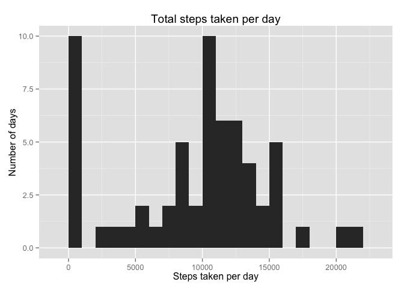
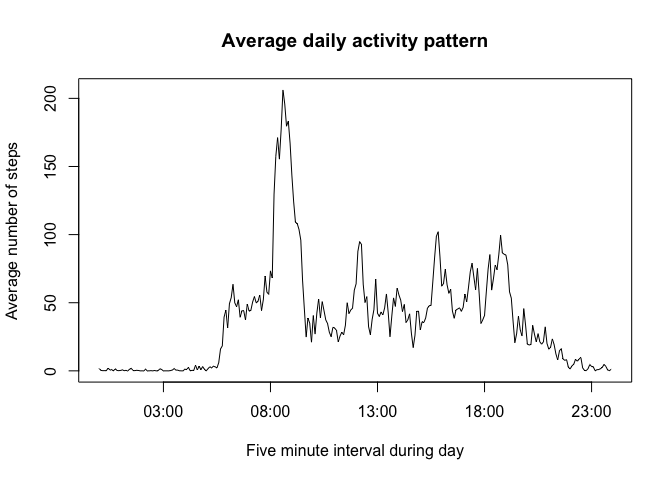
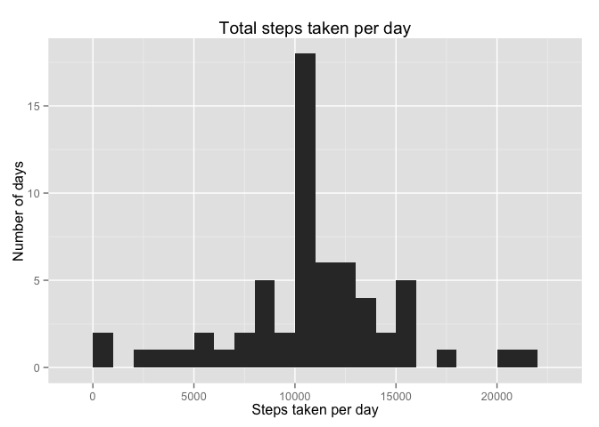
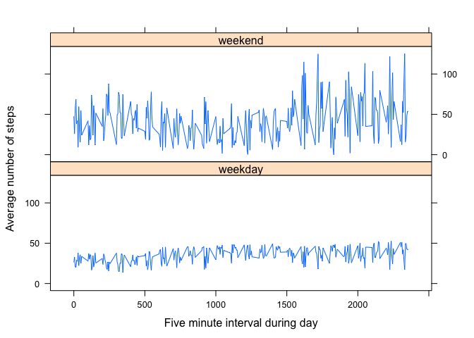

# Reproducible Research: Peer Assessment 1


## Loading and preprocessing the data
We start by loading the data and examining its summary.


```r
dt <- read.csv('activity.csv')
summary(dt)
```

```
##      steps                date          interval     
##  Min.   :  0.00   2012-10-01:  288   Min.   :   0.0  
##  1st Qu.:  0.00   2012-10-02:  288   1st Qu.: 588.8  
##  Median :  0.00   2012-10-03:  288   Median :1177.5  
##  Mean   : 37.38   2012-10-04:  288   Mean   :1177.5  
##  3rd Qu.: 12.00   2012-10-05:  288   3rd Qu.:1766.2  
##  Max.   :806.00   2012-10-06:  288   Max.   :2355.0  
##  NA's   :2304     (Other)   :15840
```


## What is mean total number of steps taken per day?
Next, we calculate and plot the total number of steps taken per day. 


```r
totsteps <- tapply(dt$steps,dt$date,sum,na.rm=TRUE)
library(ggplot2)
qplot(totsteps,geom="histogram",binwidth=1000,xlab="Steps taken per day",ylab="Number of days",main="Total steps taken per day")
```

 

We observe a peak near 0 on the x-axis indicating days when less than 1000 steps were taken. We also observe a couple of days when more than 20,000 steps were taken. The mean and median of the total number of steps taken per day are **9354.2295082** and **10395** respectively.


```r
mean(totsteps)
```

```
## [1] 9354.23
```

```r
median(totsteps)
```

```
## [1] 10395
```

## What is the average daily activity pattern?
To calculate the average number of steps taken per day per 5-minute interval, we carry out four steps as detailed below.


```r
# Step 1: Exclude rows that containing missing values for number of steps taken
includeRows <- !is.na(dt$steps) 
# Step 2: Calculate the total number of steps taken per 5-minute interval
numsteps_per_interval <- tapply(dt$steps[includeRows],dt$interval[includeRows],sum) 
 # Step 3: Calculate the total number of days for which data was collected per 5-minute interval
numdays_per_interval <- tapply(dt$date[includeRows],dt$interval[includeRows],function(x) length(unique(x)))
# Step 4: Divide the result of Step 2 by that of Step 3
dailypattern <- numsteps_per_interval/numdays_per_interval 
```

We now display the average daily activity pattern as a time series plot. To make the plot, we have to reformat the interval data first. 


```r
# Reformat interval data
intervals <- unique(dt$interval[includeRows])
hours <- floor(intervals/100)
minutes <- intervals - 100*hours
time <- strptime(sprintf('%02d:%02d',hours,minutes),'%R')
# Make the time series plot
plot(x=time,y=dailypattern,type="l",xlab="Five minute interval during day",ylab="Average number of steps",main="Average daily activity pattern")
```

 

We notice that the maximum of daily activity occurs in the **8.35-8.40 AM** interval. 


```r
intervals[which.max(dailypattern)]
```

```
## [1] 835
```

## Imputing missing values

First, we examine the missing values. We see that there are **2304** missing values, and they are limited to specific days. 


```r
sum(!includeRows)
```

```
## [1] 2304
```

```r
missingdates <- unique(as.character(dt$date[!includeRows]))
missingdates
```

```
## [1] "2012-10-01" "2012-10-08" "2012-11-01" "2012-11-04" "2012-11-09"
## [6] "2012-11-10" "2012-11-14" "2012-11-30"
```

We will fill in the missing value using the average number of steps taken per day for each 5-minute interval. Note that we have already computed this value in `dailypattern`.


```r
# Turn missing dates in a longer vector with entries for each interval
missingdates <- as.factor(rep(missingdates,each=288))
num_missingdates <- length(levels(missingdates))
# Copy intervals and steps from 'dailypattern' as many as times as needed
missingintervals <- as.integer(rep(rownames(dailypattern),num_missingdates))
missingsteps <- as.integer(rep(dailypattern,num_missingdates))
```

Armed with these imputed missing values, we create a new data frame (`dt2`) and merge that with the valid rows (i.e., no NAs) from the original data frame (`dt[includeRows,]`).


```r
# Create new data frame with missing values
dt2 <- data.frame(steps=missingsteps,date=missingdates,interval=missingintervals)
# Merge new data frame with the valid rows of the old one
dt3 <- merge(dt[includeRows,],dt2,all=TRUE)
# Remove the data frame we no longer need
rm(dt2)
```

We plot the total number of steps taken per day for this new filled-in data frame.


```r
totsteps2 <- tapply(dt3$steps,dt3$date,sum,na.rm=FALSE)
qplot(totsteps2,geom="histogram",binwidth=1000,xlab="Steps taken per day",ylab="Number of days",main="Total steps taken per day")
```

 

The mean and median of the total number of steps taken per day are as follows:


```r
mean(totsteps2)
```

```
## [1] 10749.77
```

```r
median(totsteps2)
```

```
## [1] 10641
```

Previously the total number of steps taken on the days for which data were not available was set to 0. Now that we have filled in the missing values, the total number of steps taken on each missing date (`num_missingdates` = 8) is set to `sum(as.integer(dailypattern))` = 10641 steps. Therefore, both the mean and median have increased from before. This change is also reflected in the shape of the histogram. There is now a pronounced peak near 10,000 steps. Comparing the counts in the bin at 10,000 for the two plots shows a difference of 18 (new plot) - 10 (old plot) = 8 days. 

## Are there differences in activity patterns between weekdays and weekends?

To understand differences in activity patterns between weekdays and weekends, we create a new factor variable to identify weekdays and weekends in the data.


```r
# Convert to date format and use weekdays function
isweekday <- weekdays(as.Date(dt3$date,'%Y-%m-%d'))
# Identify weekends
satsun <- isweekday=="Saturday" | isweekday=="Sunday"
# Set levels of new variable accordingly
isweekday[satsun] <- "weekend"
isweekday[!satsun] <- "weekday"
isweekday <- as.factor(isweekday)
# Add new factor variable to filled-in data frame
dt3$daytype <- isweekday
```

Compute daily activity patterns for weekdays and weekends.


```r
# Calculate the total number of steps taken per 5-minute interval
numsteps_per_interval_weekday <- tapply(dt3$steps[!satsun],dt$interval[!satsun],sum) 
numsteps_per_interval_weekend <- tapply(dt3$steps[satsun],dt$interval[satsun],sum) 
 # Calculate the total number of days for which data was collected per 5-minute interval
numdays_per_interval_weekday <- tapply(dt$date[!satsun],dt$interval[!satsun],function(x) length(unique(x)))
numdays_per_interval_weekend <- tapply(dt$date[satsun],dt$interval[satsun],function(x) length(unique(x)))
# Divide the results of previous steps
dailypattern_weekday <- numsteps_per_interval_weekday/numdays_per_interval_weekday
dailypattern_weekend <- numsteps_per_interval_weekend/numdays_per_interval_weekend
# Create new data frame with these values
dt4 <- data.frame(dailypattern=c(dailypattern_weekday,dailypattern_weekend),interval=c(as.integer(rownames(dailypattern_weekday)),as.integer(rownames(dailypattern_weekend))),daytype=as.factor(c(rep("weekday",length(dailypattern_weekday)),rep("weekend",length(dailypattern_weekend)))))
```

Plot the daily activity patterns for weekdays and weekends.


```r
library(lattice)
xyplot(dailypattern ~ interval | daytype, data=dt4,layout=c(1,2),xlab="Five minute interval during day",ylab="Average number of steps",type="l")
```

 

We see that pattern of activity is different on weekends than on weekdays. The average number of steps taken per weekend day (`mean(dailypattern_weekend)` = 42.5285639) is higher than that per weekday (`mean(dailypattern_weekday)` = 35.4200391). Note that the variations for the weekend plot are larger than the variations in the weekday plot because the number of weekend days in the dataset (`sum(satsun)/288` = 16) is nearly one-third of the number of number of weekdays in the dataset (`sum(!satsun)/288` = 45).
